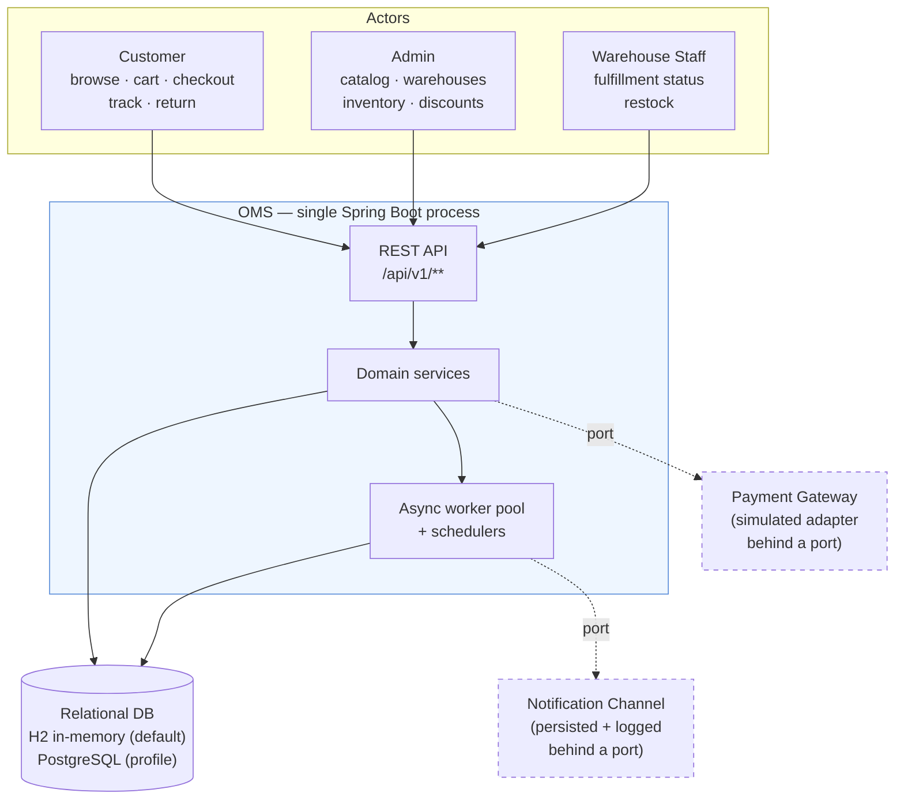
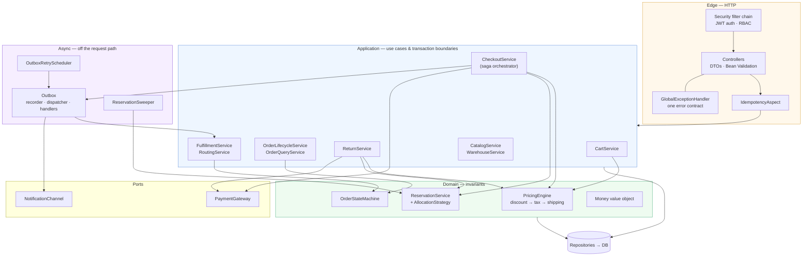
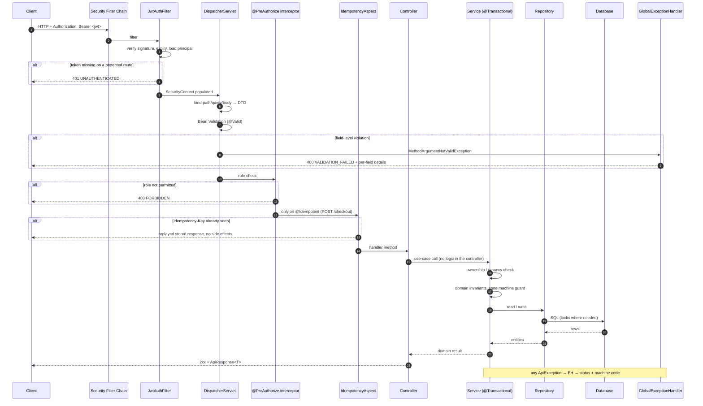
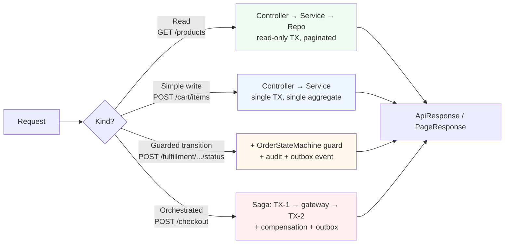
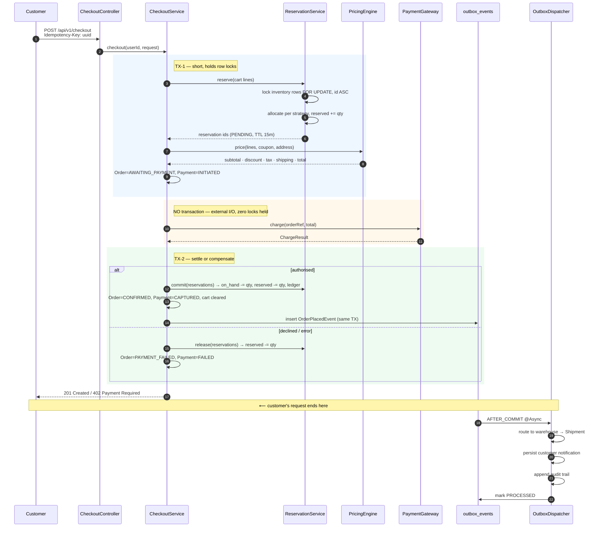
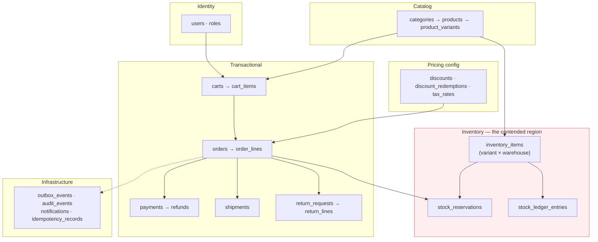
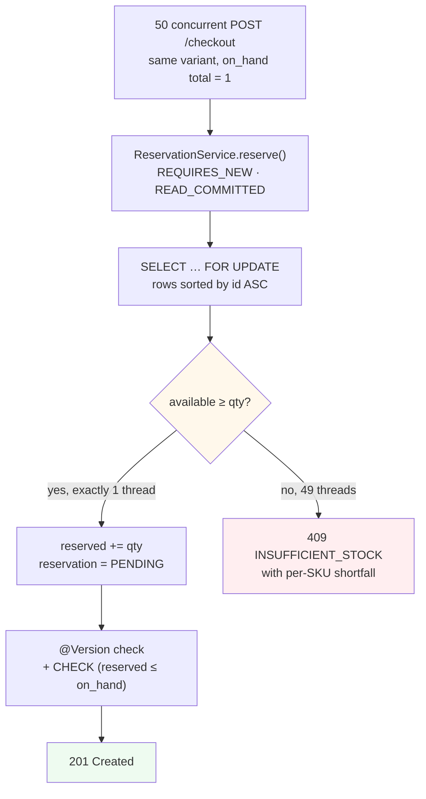
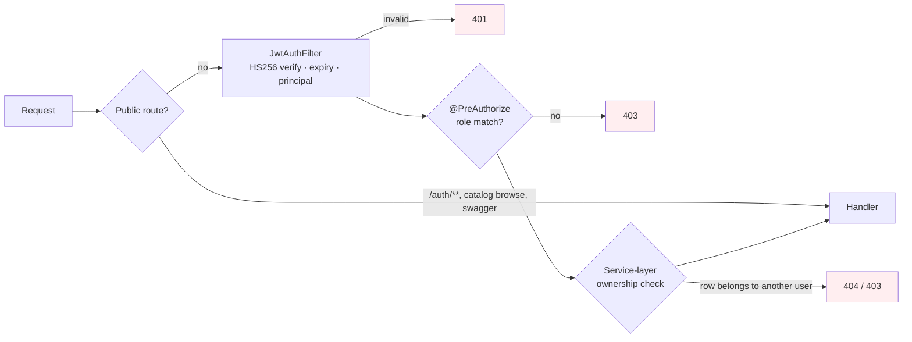

# High-Level Design — E-commerce Order Management Service

> Status: **design, pre-implementation**. Companion to [`LLD.md`](./LLD.md).
> This document answers *what the system is, who talks to it, and how a request travels through it*.
> The LLD answers *how each piece is built*.
> Stack: Spring Boot 3.3 · Java 17 · Spring Data JPA · H2 (swappable to PostgreSQL) · Flyway · Spring Security (JWT)

---

## 1. Problem Framing

The brief describes a full commerce back end, but only four of its requirements are
architecturally load-bearing. The shape of this system is a direct consequence of them:

| Requirement from the brief | Architectural consequence |
|---|---|
| "the same unit cannot be oversold across warehouses" under concurrency | Inventory is a **reservation ledger**, not a counter. Stock mutation is funnelled through one serialising component. |
| "order placement should atomically reflect cart, inventory, and payment state" | Checkout is a **saga with compensation** across three transaction boundaries — an external payment call cannot sit inside a lock-holding transaction. |
| "downstream pipeline … should run without blocking the customer's checkout response" | A **transactional outbox** splits the request path from the fulfillment/notification/audit path. |
| Discounts, taxes, returns, refunds | A single **pricing pipeline** is the one authority on money, reused by preview, checkout, and refund. |

Everything else — catalog, cart, warehouses, auth — is conventional CRUD, deliberately
built broad and shallow so the budget lands on the four rows above.

**Non-goals**, per the brief: no UI, no containerisation or CI/CD, no microservices, no
OAuth/SSO/MFA, no production observability stack. These are excluded by scope, not by
oversight; §11 records where each would attach if it were in scope.

---

## 2. System Context

One deployable Spring Boot process, three human actor classes, no external runtime
dependencies beyond a database.



The two dashed boxes are the only places the system reaches outside itself. Both sit
behind an interface (`PaymentGateway`, `NotificationChannel`) with an in-process
implementation, so the system runs with zero external setup while keeping a real
provider a one-class swap. The gateway simulation is *deterministic*, not random —
specific amounts and card tokens force decline, timeout, and error paths, which is what
makes the failure matrix in LLD §5.3 testable rather than aspirational.

---

## 3. Component View

Package-by-feature, one Maven module. Each box below is a package that owns its own
tables; cross-feature calls go service-to-service, never repository-to-repository.



Three things to read off this diagram:

- **`ReservationService` is the only writer of stock.** Every path that moves inventory —
  checkout, cancellation, return restock, admin adjustment, TTL sweep — goes through it.
  A single serialisation point is what makes the oversell guarantee provable.
- **`PricingEngine` is the only calculator of money.** `/cart/preview`, checkout, and
  pro-rata refunds all call the same pipeline, so a preview total can never disagree with
  the charged total.
- **`CheckoutService` is the only orchestrator that touches a port mid-flow.** It is the
  one place where compensation logic lives.

---

## 4. API Request Flow

### 4.1 The generic path — every request

This is the pipeline each of the ~30 endpoints traverses. Nothing bespoke per endpoint.



Four deliberate properties of this path:

1. **Validation happens before the service.** A malformed request never reaches business
   logic, so services can assume well-formed input and stay free of defensive checks.
2. **Role check and ownership check are separate.** `@PreAuthorize` answers "may this
   *role* call this endpoint"; the service answers "may this *user* touch this row".
   Role-only checks would let customer A read customer B's order — see LLD §11.
3. **One error contract.** Field violations, domain exceptions, and unexpected errors all
   exit through `GlobalExceptionHandler` and emerge in the same JSON envelope with a
   machine-readable `code`. Clients branch on `code`, never on prose.
4. **Idempotency is declarative.** It is an aspect on an annotation, so it costs nothing
   on the 29 endpoints that do not need it.

### 4.2 Request-flow variants

Not every endpoint is the same shape. Four classes, in increasing cost:



Only one endpoint is in the red class. That concentration is intentional: the hard
problem is isolated in a single orchestrator instead of smeared across the API.

### 4.3 Checkout — the critical path

The one flow worth reading end to end. Timings are the structure, not the numbers.



The single most important line in this diagram is the middle rectangle: **no database
transaction is open while the payment gateway is being called.** A lock held across an
unbounded network wait is what turns a slow gateway into a site-wide checkout outage.
Atomicity is instead carried by *state* — reservation status, order status, payment
status — with explicit compensation on each failure branch, and a TTL sweeper as the
backstop for a crash between TX-1 and TX-2. Full failure matrix: LLD §5.3.

### 4.4 Synchronous vs. asynchronous boundary

```mermaid
flowchart LR
    subgraph SYNC["On the request path — customer waits"]
        S1["Auth + validation"] --> S2["Reserve stock"] --> S3["Price the order"] --> S4["Charge payment"] --> S5["Commit or compensate"] --> S6["201 response"]
    end

    subgraph ASYNCP["Off the request path — after commit"]
        A1["Fulfillment routing<br/>→ Shipment"]
        A2["Customer notification"]
        A3["Audit log append"]
        A4["Retry / dead-letter"]
    end

    S6 -.->|outbox row committed in TX-2| A1
    A1 --> A2 --> A3
    A3 -.->|on failure| A4

    style SYNC fill:#eef6ff,stroke:#5b8dd9
    style ASYNCP fill:#f6eeff,stroke:#8d5bd9
```



The line is drawn by one question: *does the customer need this to be true before they
see a confirmation?* Stock, price, and payment — yes. A warehouse pick task, an email,
an audit row — no. Moving those three off the request path is what satisfies
requirement #3, and the outbox is what makes "off the request path" not mean "lost if the
JVM dies", since the event row is committed in the same transaction as the order.

---

## 5. Data Architecture

Twenty-odd business tables in one schema, plus four infrastructure tables
(`outbox_events`, `audit_events`, `notifications`, `idempotency_records`) that carry no
business relationships. Full ER model in LLD §4; the high-level grouping:



Two data decisions shape everything:

- **`available` is never stored.** It is derived as `on_hand - reserved`. A stored
  availability column is a second source of truth that drifts under concurrency; deriving
  it makes oversell an arithmetic impossibility as long as `0 ≤ reserved ≤ on_hand` holds
  — and that invariant is enforced by a DB `CHECK` constraint, not just by application
  code.
- **`inventory_items` is the only hot region.** All contention lives on rows keyed by
  `(variant_id, warehouse_id)`. Knowing exactly where contention is localised is what
  allows a targeted locking strategy instead of coarse table-level pessimism.

Schema is owned by Flyway with `ddl-auto: validate`, so H2 and PostgreSQL are held to
the identical schema and drift fails at startup rather than in production. The migrations
are vendor-neutral SQL, which is what makes the DB swap a profile flag
(`-Dspring.profiles.active=postgres`) rather than a project.

---

## 6. Concurrency and Correctness Model

Requirement #1 in one diagram: fifty simultaneous buyers, one unit of stock.



Three layers of defence, each catching what the one above could miss:

| Layer | Mechanism | Catches |
|---|---|---|
| 1 | Pessimistic row locks (`FOR UPDATE`) | Interleaved read-check-write on the same inventory row |
| 2 | Deterministic lock ordering (PK ascending, one query) | Deadlock between two carts touching the same SKUs in opposite order |
| 3 | `@Version` + DB `CHECK (reserved <= on_hand)` | A future code path that forgets to lock — the DB refuses the write |

Layer 3 is the one that matters for longevity. Layers 1 and 2 are correct today; layer 3
stays correct after someone else edits the code.

The claim is verified, not asserted: `OversellPreventionIT` fires 50 threads off a
`CountDownLatch` and asserts exactly 1 success, 49 conflicts, `sum(on_hand) == 0`,
`sum(reserved) == 0`, and exactly one `COMMITTED` reservation. Repeated at `on_hand = 10`
for exactly 10 winners.

---

## 7. Security Architecture



Stateless JWT bearer tokens, BCrypt password hashing, `anyRequest().authenticated()` as
the default so a new endpoint is protected unless explicitly opened. Three roles with a
complete permission matrix in LLD §11. Advanced auth (OAuth, SSO, MFA) is out of scope
per the brief; the seam is `JwtService`, which is the only component that would change.

The deliberate design point is the **two-stage authorization** shown above. Role checks
are declarative at the edge; ownership is enforced in the service where the row is
actually loaded. Collapsing these into one layer is the most common way commerce APIs
leak other customers' orders.

---

## 8. Reliability Model

| Concern | Mechanism | Failure behaviour |
|---|---|---|
| Duplicate checkout (double-click, client retry) | `@Idempotent` + `idempotency_records` | Stored response replayed; one order, one charge |
| Payment gateway timeout | Reservation left `PENDING`; payment marked `UNKNOWN` | `502`; safe retry with same key; TTL releases stock |
| Crash between TX-1 and TX-2 | `ReservationSweeper` at 15-min TTL | Stock returns to the pool; stale order cancelled |
| Downstream handler failure | Outbox retry, exponential backoff, 5 attempts | `DEAD_LETTER` row, visible via an admin endpoint |
| At-least-once delivery | Handlers idempotent on `(event_id, handler_name)` | Redelivery is a no-op |
| Async pool saturation | Bounded pool + `CallerRunsPolicy` | Degrades to synchronous; never drops an event |
| Optimistic lock clash | 3 retries with jittered backoff | Success on retry, else `409 CONCURRENT_MODIFICATION` |

The unifying idea: **every in-flight state has a timeout that resolves it.** No
reservation, order, or outbox event can sit unresolved indefinitely, which means no
failure mode permanently leaks stock or hides an error.

---

## 9. Quality Attributes

| Attribute | How this design addresses it | Where it is proven |
|---|---|---|
| Correctness under concurrency | Reservation ledger, three locking layers, DB `CHECK` backstop | `OversellPreventionIT` |
| Consistency across cart/inventory/payment | Saga with explicit compensation per branch | `CheckoutFlowIT` + failure-path tests |
| Responsiveness | External I/O outside transactions; downstream work after commit | Checkout latency = TX-1 + gateway + TX-2 only |
| Monetary accuracy | `Money` value object, `BigDecimal` scale 2 HALF_UP, no `double` | `MoneyTest`, pro-rata refund test |
| Extensibility | Strategy + Registry for allocation, discounts, gateways, handlers | New discount type = one class, zero edits |
| Testability | Ports with in-process fakes; pure domain (state machine, pricing) | Unit tests need no Spring context |
| Portability | Flyway + `ddl-auto: validate` + vendor-neutral SQL | Same schema on H2 and PostgreSQL |
| Security | Stateless JWT; role check at edge, ownership in service | Per-role MockMvc suite |

---

## 10. Deployment and Runtime View

Deliberately trivial, because deployment is out of scope.

```mermaid
flowchart TB
    subgraph JVM["Single JVM"]
        TC["Embedded Tomcat<br/>request threads"]
        POOL["Async executor<br/>core 4 · max 8 · queue 500"]
        SCH["Schedulers<br/>ReservationSweeper (1m)<br/>OutboxRetry (30s)"]
        HIK["HikariCP connection pool"]
    end
    H2[("H2 in-memory<br/>PostgreSQL-compat mode")]
    PGSQL[("PostgreSQL<br/>-Dspring.profiles.active=postgres")]

    TC --> HIK
    POOL --> HIK
    SCH --> HIK
    HIK --> H2
    HIK -.-> PGSQL

    style PGSQL stroke-dasharray: 5 5
```

`mvn spring-boot:run` is the entire setup: H2 in memory, Flyway builds the schema, and
`V4__seed_demo_data.sql` loads 4 nested categories, ~12 products / ~20 variants, 3
warehouses with deliberately uneven stock, one user per role, and 2 coupons. The seed
includes a SKU with exactly one unit so the oversell demo is runnable immediately.

Two pools share one database: request threads and the bounded async executor. The async
pool is capped well below the Hikari pool so outbox dispatch can never starve checkout of
connections.

---

## 11. Scaling Path (documented, not built)

Microservices and distributed systems are out of scope. Recording where the seams are
costs nothing now and is the difference between a monolith and a dead end:

| Pressure | Next move | Why it is cheap here |
|---|---|---|
| Read-heavy catalog traffic | Cache layer in front of `CatalogService`; read replicas | Catalog is already read-only from the request path |
| Checkout throughput | Horizontal instances behind a load balancer | Stateless JWT, no session affinity; all coordination is in the DB |
| Inventory row contention on hot SKUs | Shard inventory rows per warehouse (already the natural key) or move to a queue-per-SKU | Contention is already localised to one table and one writer |
| Downstream volume | Replace `OutboxDispatcher` with Kafka/SQS consumers | The outbox table is the producer contract; handlers do not change |
| Real payments | Implement `PaymentGateway` against a live provider + webhook endpoint | Port already exists; simulation is one adapter among N |
| Real notifications | Implement `NotificationChannel` for SMTP/SMS | Same |
| Observability | Micrometer on the saga and outbox; trace id already on every error | `traceId` is already threaded through the error contract |

Each row is a single seam, because every external interaction already sits behind an
interface. ADR-0004 records the outbox as the explicit Kafka drop-in point.

---

## 12. Key Trade-offs

Stated as choices with costs, not as features:

| Decision | Alternative rejected | Cost accepted |
|---|---|---|
| Reservation ledger | Decrement `on_hand` at checkout | Extra table + a TTL sweeper to run |
| Saga across 3 transactions | One `@Transactional` wrapping the gateway call | Orchestration code and a compensation path per branch |
| Pessimistic locks on inventory | Purely optimistic retry | Serialises same-SKU checkouts; chosen because retry storms on hot SKUs are worse |
| Transactional outbox | Plain `@Async` event listener | An extra table and a retry scheduler; buys at-least-once instead of best-effort |
| Derived `available` | Stored `available` column | One subtraction per read; removes a drift class entirely |
| H2 by default | PostgreSQL by default | Not production-shaped; buys a zero-setup reviewer experience, and the profile swap is tested |
| Modular monolith | Microservices | No independent scaling; explicitly out of scope, and module boundaries are drawn so it stays possible |

---

## 13. Document Map

| Document | Contains |
|---|---|
| `README.md` | Quick start, assumption register, API table, demo walkthrough |
| `docs/HLD.md` | This file — context, components, request flows, quality attributes |
| `docs/LLD.md` | Class-level design, ER model, locking queries, patterns, test strategy, build order |
| `docs/API.md` | Endpoint catalogue with roles, request/response samples, error codes |
| `docs/adr/*.md` | Decision records: H2 default, reservation vs. decrement, saga vs. single TX, outbox vs. broker |
| `requests.http` | Runnable end-to-end walkthrough |
