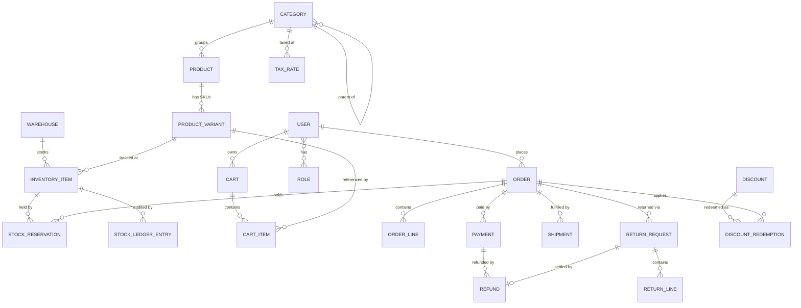
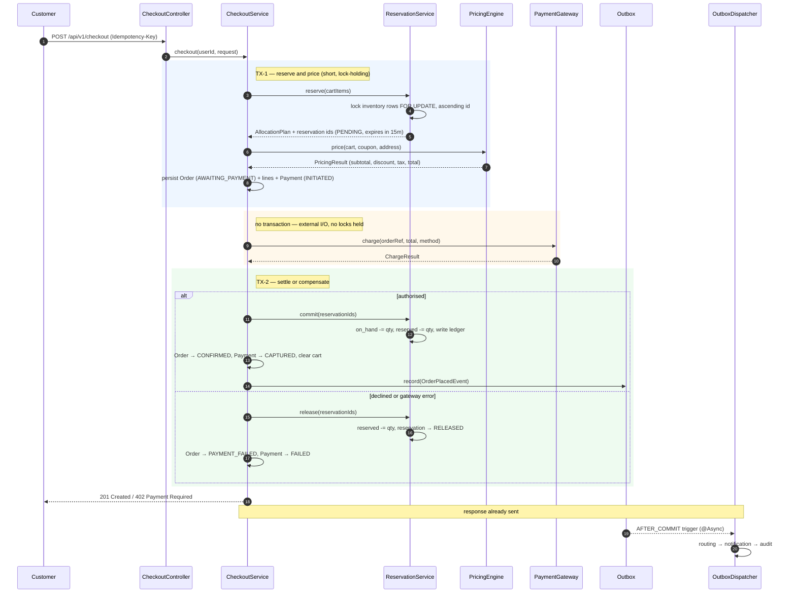
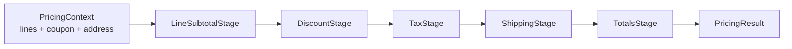
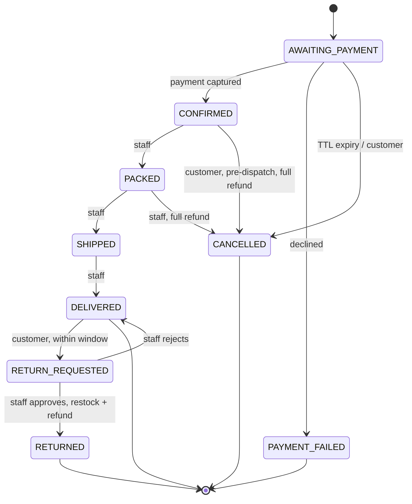
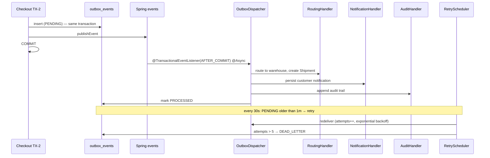

# Low-Level Design — E-commerce Order Management Service

> Status: **design, pre-implementation**. No code is written yet.
> Stack: Spring Boot 3.3 · Java 17 · Spring Data JPA · H2 (in-memory, swappable) · Flyway · Spring Security (JWT)

---

## 1. Design Philosophy

Four requirements in the brief carry real engineering weight. Everything else is
conventional CRUD and is built broad but shallow.

| # | Requirement | Where the design earns its keep |
|---|---|---|
| 1 | The same unit cannot be oversold across warehouses under concurrent purchases | Two-phase stock **reservation** with deterministic pessimistic locking + version guard |
| 2 | Order placement atomically reflects cart, inventory, and payment state | **Saga with compensation** across three transaction boundaries, not one long transaction |
| 3 | Downstream pipeline must not block the checkout response | **Transactional outbox** drained by an async dispatcher after commit |
| 4 | Discounts, taxes, returns, refunds | **Chain of Responsibility** pricing pipeline over immutable `Money` value objects |

The guiding constraint from the scoping conversation: *minimum code, maximum
demonstrable behaviour*. Every class below exists because a requirement needs it.
Patterns are applied where they remove branching or enable substitution — not for
decoration.

---

## 2. Architectural Layering

A single Maven module, organised **package-by-feature**. Each feature package is
internally layered and only its `api` + `service` surface is reachable from outside.

```
api  (HTTP)        →  Controllers, Request/Response DTOs, validation annotations
service  (use case)→  Transaction boundaries, orchestration, authorization checks
domain  (model)    →  Entities, value objects, enums, invariants, state machine
repository (data)  →  Spring Data interfaces, Specifications, locking queries
port / adapter     →  Interfaces for anything external (payment, notification)
```

**Dependency rule:** `api → service → domain ← repository`. `domain` imports nothing
from the layers above it. Cross-feature calls go service-to-service only, never
repository-to-repository, so each feature owns its own tables.

---

## 3. Folder Structure

```
ecommerce-order-management/
├── README.md                          # polished entry point: HLD, quick start, API table
├── CLAUDE.md                          # AI workflow / agent instructions (submission requirement)
├── AGENTS.md                          # symlinked twin of CLAUDE.md
├── pom.xml
├── docs/
│   ├── HLD.md                         # system context, component view, data flow
│   ├── LLD.md                         # this document
│   ├── API.md                         # endpoint catalogue with roles + samples
│   ├── adr/
│   │   ├── 0001-in-memory-h2-default.md
│   │   ├── 0002-reservation-over-decrement.md
│   │   ├── 0003-saga-not-single-transaction.md
│   │   └── 0004-outbox-over-message-broker.md
│   └── raw/                           # raw design notes + prompts used (submission requirement)
├── requests.http                      # runnable happy-path walkthrough
└── src
    ├── main
    │   ├── java/com/ecommerce/oms
    │   │   ├── OmsApplication.java
    │   │   │
    │   │   ├── common/                            # zero business logic
    │   │   │   ├── config/
    │   │   │   │   ├── SecurityConfig.java
    │   │   │   │   ├── AsyncConfig.java           # bounded pool for outbox dispatch
    │   │   │   │   ├── SchedulingConfig.java
    │   │   │   │   ├── OpenApiConfig.java
    │   │   │   │   └── JpaAuditingConfig.java
    │   │   │   ├── domain/
    │   │   │   │   ├── BaseEntity.java            # id, createdAt, updatedAt
    │   │   │   │   ├── Money.java                 # value object
    │   │   │   │   └── DomainEvent.java           # marker
    │   │   │   ├── error/
    │   │   │   │   ├── ErrorCode.java             # single catalogue of machine codes
    │   │   │   │   ├── ApiException.java          # + 6 focused subclasses
    │   │   │   │   ├── ApiError.java
    │   │   │   │   └── GlobalExceptionHandler.java
    │   │   │   ├── idempotency/
    │   │   │   │   ├── Idempotent.java            # annotation
    │   │   │   │   ├── IdempotencyAspect.java     # Proxy pattern
    │   │   │   │   └── IdempotencyRecord.java
    │   │   │   └── web/
    │   │   │       ├── ApiResponse.java
    │   │   │       ├── PageResponse.java
    │   │   │       └── AuthenticatedUser.java     # argument resolver target
    │   │   │
    │   │   ├── iam/
    │   │   │   ├── api/         AuthController, dto/{RegisterRequest,LoginRequest,TokenResponse}
    │   │   │   ├── domain/      User, Role, RoleName
    │   │   │   ├── repository/  UserRepository
    │   │   │   ├── security/    JwtAuthFilter, JwtService, Roles
    │   │   │   └── service/     AuthService, OmsUserDetailsService
    │   │   │
    │   │   ├── catalog/
    │   │   │   ├── api/         CategoryController, ProductController, AdminProductController
    │   │   │   ├── domain/      Category, Product, ProductVariant, ProductStatus
    │   │   │   ├── repository/  CategoryRepository, ProductRepository, ProductVariantRepository
    │   │   │   │                spec/ProductSpecifications.java      # Specification pattern
    │   │   │   └── service/     CategoryService, ProductService
    │   │   │
    │   │   ├── warehouse/
    │   │   │   ├── api/         WarehouseController
    │   │   │   ├── domain/      Warehouse
    │   │   │   └── service/     WarehouseService
    │   │   │
    │   │   ├── inventory/
    │   │   │   ├── api/         InventoryController
    │   │   │   ├── allocation/                                       # Strategy pattern
    │   │   │   │   ├── AllocationStrategy.java
    │   │   │   │   ├── SingleWarehouseFirstStrategy.java
    │   │   │   │   ├── SplitAcrossWarehousesStrategy.java
    │   │   │   │   └── AllocationPlan.java
    │   │   │   ├── domain/      InventoryItem, StockReservation, ReservationStatus,
    │   │   │   │                StockLedgerEntry, StockMovementType
    │   │   │   ├── repository/  InventoryItemRepository, StockReservationRepository
    │   │   │   └── service/     InventoryService, ReservationService, ReservationSweeper
    │   │   │
    │   │   ├── cart/
    │   │   │   ├── api/         CartController
    │   │   │   ├── domain/      Cart, CartItem
    │   │   │   ├── repository/  CartRepository
    │   │   │   └── service/     CartService
    │   │   │
    │   │   ├── pricing/
    │   │   │   ├── engine/                                           # Chain of Responsibility
    │   │   │   │   ├── PricingEngine.java
    │   │   │   │   ├── PricingContext.java
    │   │   │   │   ├── PricingStage.java
    │   │   │   │   ├── LineSubtotalStage.java
    │   │   │   │   ├── DiscountStage.java
    │   │   │   │   ├── TaxStage.java
    │   │   │   │   ├── ShippingStage.java
    │   │   │   │   └── TotalsStage.java
    │   │   │   ├── discount/                                         # Strategy + Registry
    │   │   │   │   ├── domain/    Discount, DiscountType, DiscountRedemption
    │   │   │   │   ├── rule/      DiscountRule, PercentageOffRule, FlatAmountOffRule,
    │   │   │   │   │               CategoryScopedRule, DiscountRuleRegistry
    │   │   │   │   ├── repository/DiscountRepository, DiscountRedemptionRepository
    │   │   │   │   └── service/   DiscountService
    │   │   │   └── tax/
    │   │   │       ├── domain/    TaxRate
    │   │   │       └── service/   TaxCalculator
    │   │   │
    │   │   ├── order/
    │   │   │   ├── api/         CheckoutController, OrderController
    │   │   │   ├── domain/      Order, OrderLine, OrderStatus,
    │   │   │   │                OrderStateMachine, OrderFactory
    │   │   │   ├── event/       OrderPlacedEvent, OrderStatusChangedEvent, OrderCancelledEvent
    │   │   │   ├── repository/  OrderRepository, OrderLineRepository
    │   │   │   └── service/     CheckoutService, OrderQueryService, OrderLifecycleService
    │   │   │
    │   │   ├── payment/
    │   │   │   ├── domain/      Payment, PaymentStatus, Refund, RefundStatus
    │   │   │   ├── gateway/                                          # Port + Adapter
    │   │   │   │   ├── PaymentGateway.java
    │   │   │   │   ├── SimulatedPaymentGateway.java
    │   │   │   │   ├── ChargeRequest.java / ChargeResult.java
    │   │   │   │   └── RefundRequest.java / RefundResult.java
    │   │   │   ├── repository/  PaymentRepository, RefundRepository
    │   │   │   └── service/     PaymentService, RefundService
    │   │   │
    │   │   ├── fulfillment/
    │   │   │   ├── api/         FulfillmentController                # warehouse staff
    │   │   │   ├── domain/      Shipment, ShipmentStatus
    │   │   │   ├── repository/  ShipmentRepository
    │   │   │   └── service/     FulfillmentService, RoutingService
    │   │   │
    │   │   ├── returns/
    │   │   │   ├── api/         ReturnController
    │   │   │   ├── domain/      ReturnRequest, ReturnLine, ReturnStatus, ReturnReason
    │   │   │   ├── repository/  ReturnRequestRepository
    │   │   │   └── service/     ReturnService
    │   │   │
    │   │   ├── notification/                                         # Port + Adapter
    │   │   │   ├── domain/      Notification, NotificationChannelType
    │   │   │   ├── channel/     NotificationChannel, PersistedNotificationChannel
    │   │   │   └── service/     NotificationService
    │   │   │
    │   │   ├── audit/
    │   │   │   ├── domain/      AuditEvent
    │   │   │   ├── repository/  AuditEventRepository
    │   │   │   └── service/     AuditService
    │   │   │
    │   │   └── outbox/
    │   │       ├── domain/      OutboxEvent, OutboxStatus
    │   │       ├── repository/  OutboxEventRepository
    │   │       └── service/     OutboxRecorder, OutboxDispatcher,
    │   │                        OutboxRetryScheduler, OutboxHandler (+ 3 handlers)
    │   └── resources
    │       ├── application.yml                # default profile = h2
    │       ├── application-h2.yml
    │       ├── application-postgres.yml        # the "swap later" switch
    │       └── db/migration/
    │           ├── V1__core_schema.sql
    │           ├── V2__order_and_payment.sql
    │           ├── V3__fulfillment_returns_outbox.sql
    │           └── V4__seed_demo_data.sql
    └── test/java/com/ecommerce/oms
        ├── unit/          PricingEngineTest, OrderStateMachineTest, AllocationStrategyTest,
        │                  DiscountRuleTest, MoneyTest
        ├── integration/   CheckoutFlowIT, RbacIT, ReturnRefundIT, FulfillmentIT
        ├── concurrency/   OversellPreventionIT            # the headline test
        └── support/       IntegrationTestBase, TestDataFactory, AuthTestHelper
```

Roughly **85 production classes**. Most are 20–60 lines. No class exceeds one screen.

---

## 4. Data Model



Plus four infrastructure tables with no business relationships:
`outbox_events`, `audit_events`, `notifications`, `idempotency_records`.

### 4.1 The inventory triple

This is the crux of the whole system, so it gets stated precisely.

`inventory_items` is keyed by **`(variant_id, warehouse_id)`** — unique constraint.

| Column | Meaning |
|---|---|
| `on_hand` | Physically present in that warehouse |
| `reserved` | Promised to in-flight orders, still physically present |
| `version` | JPA `@Version`, optimistic lock guard |

**`available` is never stored.** It is derived: `available = on_hand - reserved`.
A stored `available` column is a second source of truth and drifts; deriving it makes
oversell arithmetically impossible as long as the invariant below holds.

**Invariant:** `0 ≤ reserved ≤ on_hand`, enforced by a DB `CHECK` constraint *and*
guarded in `ReservationService` before any write. The CHECK constraint is the
backstop: even a logic bug cannot persist an oversold row.

### 4.2 Money

```java
public record Money(BigDecimal amount, Currency currency) {
    // scale 2, RoundingMode.HALF_UP, normalised in the canonical constructor
    public static Money of(String amount);          public static Money zero();
    public Money plus(Money other);                 public Money minus(Money other);
    public Money multiply(int qty);                 public Money percentage(BigDecimal pct);
    public Money min(Money other);                  public boolean isNegative();
}
```

Persisted as an `@Embeddable` pair (`*_amount DECIMAL(19,2)`, `*_currency CHAR(3)`).
No `double` anywhere in the codebase. Mixed-currency arithmetic throws.

---

## 5. Core Flow — Checkout

### 5.1 Why this is not one transaction

The brief says order placement must *atomically* reflect cart, inventory, and payment.
The naive reading is one `@Transactional` method wrapping the payment call. That is
wrong, and saying why is part of the design:

- A network call inside an open transaction holds row locks for the duration of an
  unbounded external wait. Under load that serialises checkout and exhausts the pool.
- If the gateway times out, the transaction rolls back but the charge may have
  succeeded. Money and database disagree, with no record of the attempt.

Atomicity is therefore delivered by **state, not by lock duration** — a saga with
explicit compensation. The customer-visible guarantee is identical: either a confirmed,
paid order with committed stock, or no order and no held stock.

### 5.2 Sequence



Customer-visible latency = TX-1 + gateway + TX-2. Fulfillment routing, notification,
and audit are all after the response.

### 5.3 Failure matrix

| Failure point | Compensation | Customer sees |
|---|---|---|
| Insufficient stock in TX-1 | TX-1 rolls back, nothing held | `409 INSUFFICIENT_STOCK` with per-SKU shortfall |
| Coupon invalid / expired | TX-1 rolls back | `422 DISCOUNT_NOT_APPLICABLE` |
| Optimistic lock clash in TX-1 | Retry up to 3× with jittered backoff, then fail | Success on retry, or `409 CONCURRENT_MODIFICATION` |
| Gateway declines | TX-2 releases reservations | `402 PAYMENT_DECLINED`, order kept as `PAYMENT_FAILED` for history |
| Gateway times out | Reservations left `PENDING`; sweeper releases at TTL; payment marked `UNKNOWN` for reconciliation | `502 PAYMENT_UNCONFIRMED`, safe to retry with same idempotency key |
| Process dies between TX-1 and TX-2 | `ReservationSweeper` releases at TTL; order stays `AWAITING_PAYMENT` and is cancelled by the same job | Stock returns to the pool within 15 min |
| Duplicate submit (double-click) | `IdempotencyAspect` replays the stored response | Same `201` and same order id, one charge |

The timeout row is the one that matters. Nothing is left permanently stuck, and no
stock is permanently leaked, because the reservation TTL is the safety net for *every*
mid-flight crash.

---

## 6. Concurrency Design — Oversell Prevention

### 6.1 Locking

`ReservationService.reserve()` runs in a `REQUIRES_NEW`, `READ_COMMITTED` transaction:

```java
@Lock(LockModeType.PESSIMISTIC_WRITE)
@Query("select i from InventoryItem i where i.id in :ids order by i.id asc")
List<InventoryItem> lockAllById(@Param("ids") List<Long> ids);
```

Three defences, layered:

1. **Pessimistic row locks** (`SELECT ... FOR UPDATE`) — serialises concurrent readers
   of the same inventory row so the read-check-write cycle cannot interleave. Supported
   identically by H2 (MVStore) and PostgreSQL, so the swap is behaviour-preserving.
2. **Deterministic lock ordering** — candidate rows are collected, sorted by primary key
   ascending, then locked in one query. Two carts touching the same two SKUs in opposite
   order cannot deadlock, because both acquire in the same global order.
3. **`@Version` optimistic lock + DB `CHECK (reserved <= on_hand)`** — catches anything
   that slips past, including a future code path that forgets to lock.

### 6.2 Allocation

`AllocationStrategy` (Strategy pattern) decides *which* warehouses fill a line:

```java
public interface AllocationStrategy {
    AllocationPlan allocate(ProductVariant variant, int qty, List<InventoryItem> candidates);
}
```

- `SingleWarehouseFirstStrategy` (default) — prefer one warehouse that can fill the whole
  line, chosen by zone proximity to the shipping address, then by highest available.
  Fewer shipments, cheaper fulfillment.
- `SplitAcrossWarehousesStrategy` (fallback) — greedily fills across warehouses when no
  single one suffices.

Selection is injected, so the behaviour is a one-line configuration change and both
strategies are unit-testable with plain lists and no database.

### 6.3 The proof

`OversellPreventionIT` is the test that demonstrates requirement #1:

- Seed one variant with `on_hand = 1` split across 2 warehouses (1 and 0).
- 50 threads, `CountDownLatch` released simultaneously, each posting `/checkout`.
- Assert: exactly **1** response is `201`, exactly **49** are `409`,
  `sum(on_hand) == 0`, `sum(reserved) == 0`, and exactly one `COMMITTED` reservation.

Repeated for `on_hand = 10` with 50 threads: exactly 10 winners.

---

## 7. Pricing Pipeline

Chain of Responsibility. Each stage reads the accumulated context and contributes one
kind of money, so tax never accidentally precedes discount.



```java
public interface PricingStage {
    void apply(PricingContext ctx);
    int order();                     // stages are sorted, not hand-wired
}
```

**Ordering is a business rule, not an accident:** discount applies to the taxable base,
tax is computed on the post-discount amount, shipping is added after tax and is itself
untaxed. Stated explicitly in the README assumptions.

### 7.1 Discounts

```java
public interface DiscountRule {
    DiscountType type();
    boolean isApplicable(Discount d, PricingContext ctx);
    Money computeDiscount(Discount d, PricingContext ctx);
}
```

`DiscountRuleRegistry` builds a `Map<DiscountType, DiscountRule>` from all injected
beans, so a new discount type is one new class and zero edits elsewhere — no `switch`
grows over time.

Supported: `PERCENTAGE_OFF` (with max-cap), `FLAT_AMOUNT_OFF`, both optionally scoped to
a category and gated on minimum order value, validity window, global usage cap, and
per-customer cap via `discount_redemptions`. One coupon per order — stacking is
explicitly out of scope and documented as such.

### 7.2 Tax

`TaxCalculator` resolves the rate per line by walking the category tree upward until a
`tax_rate` is found, falling back to a configured default. Prices are tax-**exclusive**.
Rate resolution is cached per request in `PricingContext`.

---

## 8. Order Lifecycle



Table-driven, not an `if` forest:

```java
final class OrderStateMachine {
    private static final Map<OrderStatus, Set<OrderStatus>> ALLOWED = Map.of(...);
    void assertCanTransition(OrderStatus from, OrderStatus to);   // else 409 ILLEGAL_TRANSITION
    boolean isTerminal(OrderStatus s);
}
```

Every accepted transition writes an `AuditEvent` (actor, from, to, reason, timestamp) and
publishes `OrderStatusChangedEvent` to the outbox, which is what drives the customer
notification. The state machine is pure and gets exhaustive unit tests over all
`OrderStatus × OrderStatus` pairs — cheap coverage of a high-risk rule.

---

## 9. Async Downstream Pipeline

Requirement #3. An in-process event bus alone loses events if the JVM dies between
commit and handler execution, so the outbox row is written **inside** the checkout
transaction and dispatch happens after.



- `AFTER_COMMIT` guarantees handlers never observe uncommitted state.
- `@Async` on a **bounded** `ThreadPoolTaskExecutor` (core 4, max 8, queue 500,
  `CallerRunsPolicy`) — the pool degrades to synchronous rather than dropping events.
- Handlers are **idempotent** and keyed on `(event_id, handler_name)`, because retry
  means at-least-once delivery.
- `OutboxHandler` is an interface; each handler self-registers for its event types
  (Observer pattern). Adding a downstream consumer touches no existing file.
- `DEAD_LETTER` rows are queryable by an admin endpoint — a poison event is visible
  rather than silent.

No broker. Distributed systems are out of scope, and the outbox demonstrates the same
delivery semantics inside one process. ADR-0004 records that if this were real, the
dispatcher is the single seam where Kafka would drop in.

---

## 10. Returns and Refunds

`POST /api/v1/orders/{id}/returns` with per-line quantities. Validated against:
return window (configurable, default 7 days from delivery), order in `DELIVERED`,
requested qty ≤ delivered qty minus already-returned qty.

On staff approval, one transaction:

1. Restock each line to the warehouse that shipped it — `on_hand += qty`, plus a
   `StockLedgerEntry` of type `RETURN_RESTOCK`.
2. Compute the refund as the **proportional share of what was actually paid**, not list
   price: line discount share and line tax are both reversed pro-rata, so
   `sum(refunds) ≤ payment.captured` always holds. This is the subtle bit in refund
   logic and gets its own unit test with an uneven 3-way split.
3. `RefundService` calls `PaymentGateway.refund()`, persists a `Refund`.
4. Order → `RETURNED` (or stays `DELIVERED` when partially returned).
5. Outbox event → notification + audit.

Cancellation before dispatch reuses the same refund path with full quantities.

---

## 11. Security and RBAC

JWT bearer, HS256, BCrypt-hashed passwords, stateless sessions. No OAuth/SSO/MFA —
explicitly out of scope.

Authorization is declared at the controller with `@PreAuthorize`, and **ownership** is
re-checked in the service, because a role check alone would let customer A read customer
B's order:

```java
@PreAuthorize("hasRole('CUSTOMER')")
public OrderResponse get(@AuthenticationPrincipal OmsUser user, @PathVariable Long id) {
    return orderQueryService.findForCustomer(id, user.getId());   // ownership enforced here
}
```

| Area | ADMIN | CUSTOMER | WAREHOUSE_STAFF |
|---|---|---|---|
| Catalog / categories | write | read | read |
| Warehouses, inventory levels | write | — | read (own warehouse) |
| Discounts, tax rates | write | apply only | — |
| Cart, checkout | — | own | — |
| Orders | read all | read own | read assigned |
| Fulfillment status | read | read | write |
| Returns | approve/reject | request own | restock |
| Outbox dead letters, audit log | read | — | — |

Every endpoint has an explicit rule; `anyRequest().authenticated()` is the default, with
only `/auth/**`, catalog browse, and Swagger open.

---

## 12. Error Handling

One `ErrorCode` enum is the single catalogue of machine-readable codes, each bound to an
HTTP status. `GlobalExceptionHandler` (`@RestControllerAdvice`) is the only place that
maps exceptions to responses.

```json
{
  "timestamp": "2026-09-26T14:12:03Z",
  "status": 409,
  "code": "INSUFFICIENT_STOCK",
  "message": "Not enough stock to fulfil the order",
  "details": [ { "sku": "TSHIRT-BLK-M", "requested": 3, "available": 1 } ],
  "path": "/api/v1/checkout",
  "traceId": "b7c1e2f0"
}
```

Validation uses Bean Validation on request DTOs (`@NotBlank`, `@Positive`, `@Valid`) so
field errors never reach the service layer. `MethodArgumentNotValidException` is
flattened into the same `details` shape — one error contract for the whole API.

---

## 13. Persistence Strategy

Default profile is **H2 in-memory**, so `mvn spring-boot:run` works with zero setup.

```yaml
spring:
  profiles.active: h2
  jpa.hibernate.ddl-auto: validate      # schema comes from Flyway, never from Hibernate
  flyway.locations: classpath:db/migration
```

Swapping is a profile flag, `-Dspring.profiles.active=postgres`, and works because:

- Migrations are hand-written, vendor-neutral SQL. No H2-specific functions, no
  `IDENTITY` quirks — `BIGINT GENERATED BY DEFAULT AS IDENTITY` works on both.
- `ddl-auto: validate` means H2 and Postgres are held to the *same* schema. Schema drift
  fails at startup instead of in production.
- All locking uses JPA `LockModeType`, which both dialects render natively.
- H2 runs in PostgreSQL compatibility mode (`MODE=PostgreSQL`) to close remaining gaps.

`V4__seed_demo_data.sql` seeds 4 nested categories, 12 products / ~20 variants,
3 warehouses with deliberately uneven stock, 3 users (one per role), and 2 coupons —
so the API is explorable the second it boots, and the oversell demo has a SKU with
exactly 1 unit.

---

## 14. Design Patterns Register

Only patterns that remove branching or enable substitution.

| Pattern | Applied at | What it buys |
|---|---|---|
| Strategy | `AllocationStrategy`, `DiscountRule`, `PaymentGateway`, `NotificationChannel` | Swap behaviour without touching callers; each variant unit-testable in isolation |
| Chain of Responsibility | `PricingStage` pipeline | Pricing order becomes declarative; a new stage cannot corrupt existing math |
| Registry | `DiscountRuleRegistry`, `OutboxHandler` lookup | Kills the `switch` that would otherwise grow with every new type |
| State machine | `OrderStateMachine` | Illegal lifecycle transitions are impossible by construction, exhaustively testable |
| Saga + Compensation | `CheckoutService` TX-1 / TX-2 | Atomic outcome without holding locks across network I/O |
| Transactional Outbox | `outbox_events` + `OutboxDispatcher` | Non-blocking downstream with at-least-once delivery |
| Observer / Pub-Sub | Spring `ApplicationEvent` + `@TransactionalEventListener` | Checkout knows nothing about routing, notification, or audit |
| Port & Adapter | `PaymentGateway`, `NotificationChannel` | Real providers drop in; tests use fakes, not mocks of concrete classes |
| Factory | `OrderFactory` (cart snapshot → order) | Keeps a 40-line construction sequence out of the service |
| Builder | Entities and DTOs (Lombok) | Readable construction of wide objects |
| Specification | `ProductSpecifications` | Composable catalog filters without a query-per-filter-combination explosion |
| Value Object | `Money`, `Address` | Currency and rounding correctness centralised once |
| Repository | Spring Data interfaces | Standard data access seam |
| Proxy / AOP | `IdempotencyAspect` | Idempotency is declarative (`@Idempotent`), zero boilerplate per endpoint |
| Template Method | `IntegrationTestBase` | One place for context, auth, and DB reset across integration tests |

---

## 15. API Surface

`/api/v1` prefix. Full catalogue with samples goes in `docs/API.md`; this is the shape.

| Method | Path | Role | Purpose |
|---|---|---|---|
| POST | `/auth/register`, `/auth/login` | public | JWT issuance |
| GET | `/products`, `/products/{id}`, `/categories` | public | Browse, filter, paginate |
| POST/PUT/DELETE | `/admin/products`, `/admin/categories` | ADMIN | Catalog management |
| POST/GET | `/admin/warehouses` | ADMIN | Warehouse management |
| PUT | `/admin/inventory` | ADMIN | Set / adjust stock |
| GET | `/inventory?variantId=` | ADMIN, STAFF | Availability across warehouses |
| POST/PUT/DELETE | `/admin/discounts`, `/admin/tax-rates` | ADMIN | Pricing configuration |
| GET/POST/PATCH/DELETE | `/cart`, `/cart/items`, `/cart/items/{id}` | CUSTOMER | Cart management |
| POST | `/cart/preview` | CUSTOMER | Dry-run pricing before checkout |
| POST | `/checkout` | CUSTOMER | Place order (`Idempotency-Key` header) |
| GET | `/orders`, `/orders/{id}` | CUSTOMER / ADMIN | Track orders |
| POST | `/orders/{id}/cancel` | CUSTOMER | Cancel pre-dispatch + refund |
| GET | `/fulfillment/queue` | STAFF | Work queue for a warehouse |
| POST | `/fulfillment/shipments/{id}/status` | STAFF | packed → shipped → delivered |
| POST | `/orders/{id}/returns` | CUSTOMER | Request partial/full return |
| POST | `/returns/{id}/approve`, `/returns/{id}/reject` | ADMIN, STAFF | Settle return + refund |
| GET | `/admin/audit-events`, `/admin/outbox/dead-letters` | ADMIN | Operational visibility |

`/cart/preview` is worth calling out: it runs the identical `PricingEngine` as checkout,
so a reviewer can see discount and tax math without placing an order.

---

## 16. Testing Strategy

| Layer | Tooling | What is actually asserted |
|---|---|---|
| Unit | JUnit 5, Mockito, AssertJ | `Money` rounding; every pricing stage; all discount rules incl. cap and min-order; exhaustive state-machine matrix; both allocation strategies; pro-rata refund math |
| Integration | `@SpringBootTest`, MockMvc, H2 | Register → browse → cart → preview → checkout → pack → ship → deliver → return → refund, asserting DB state at each step |
| Security | MockMvc per role | Each protected endpoint returns 403 for wrong role and 404/403 for cross-customer access |
| Concurrency | `ExecutorService` + `CountDownLatch` | `OversellPreventionIT` — exactly N winners for N units across 50 threads |
| Async | Awaitility | Outbox reaches `PROCESSED`; shipment, notification, and audit rows exist; retry promotes to `DEAD_LETTER` after 5 attempts |
| Idempotency | MockMvc | Same `Idempotency-Key` twice → one order, one charge, identical response body |

Target: the six flows above, not a coverage percentage. The concurrency and idempotency
tests are the ones that would catch a real regression.

---

## 17. Assumptions and Deliberate Exclusions

**Assumptions**

1. Single currency (INR), single locale. `Money` carries currency so it is extensible.
2. Prices are tax-exclusive; tax is computed post-discount; shipping is untaxed.
3. One coupon per order. No stacking.
4. Reservation TTL of 15 minutes; return window of 7 days from delivery. Both configurable.
5. Payments are simulated deterministically — specific amounts and test card tokens force
   decline, timeout, and gateway-error paths, so every branch is demonstrable and
   reproducible in tests.
6. Shipping cost is a flat configured rate. Carrier rating is not modelled.
7. Warehouse proximity uses a coarse `zone` string on address and warehouse, not geocoding.
8. Notifications persist to a table and log; no SMTP or SMS.
9. Customers have one shipping address supplied at checkout; no address book.
10. Stock is authoritative in this service — no external WMS reconciliation.

**Excluded on purpose** (each with a one-line reason in the README)

UI, Docker, CI/CD, microservices, OAuth/SSO/MFA, production observability — all
explicitly out of scope in the brief. Also skipped as low signal for the effort:
wishlists, reviews, recommendations, multi-currency FX, backorders, partial shipments of
a single line, and coupon stacking.

---

## 18. Build Order

Each step is an independently committable, runnable slice.

| # | Slice | Verifiable outcome |
|---|---|---|
| 1 | Skeleton, `common`, error handling, H2 + Flyway, Swagger | App boots, Swagger renders |
| 2 | `iam` — users, roles, JWT, security config | Register + login returns a usable token |
| 3 | `catalog` + `warehouse` + admin CRUD | Seeded catalog browsable and filterable |
| 4 | `inventory` — items, reservations, allocation, sweeper | Stock visible per warehouse; reserve/release unit-tested |
| 5 | `cart` + `pricing` + `/cart/preview` | Discount and tax math visible without ordering |
| 6 | `order` + `payment` + checkout saga + idempotency | End-to-end order placement |
| 7 | `outbox` + `fulfillment` + `notification` + `audit` | Async pipeline observable after checkout |
| 8 | `returns` + refunds | Partial return restocks and refunds pro-rata |
| 9 | Tests: unit, integration, `OversellPreventionIT` | Green suite, oversell proven impossible |
| 10 | `README.md`, `HLD.md`, `API.md`, ADRs, `requests.http` | Reviewer can run the demo in under 2 minutes |

---

## 19. Open Decisions

Flagged rather than silently assumed:

1. **`SplitAcrossWarehousesStrategy`** — implement it, or ship only
   `SingleWarehouseFirstStrategy` and leave split as a documented extension point? The
   interface exists either way; the question is whether the second implementation and its
   multi-shipment handling are worth the code.
2. **`discount_redemptions` table** — needed only for the per-customer usage cap.
   Droppable if we accept a global cap only.
3. **Shipment granularity** — one `Shipment` per order (simpler), or per warehouse
   (needed if split allocation ships).
4. **Product variants** — keep `Product → ProductVariant` (realistic; inventory keys on
   variant), or collapse to a single SKU per product and save one table plus its DTOs?
